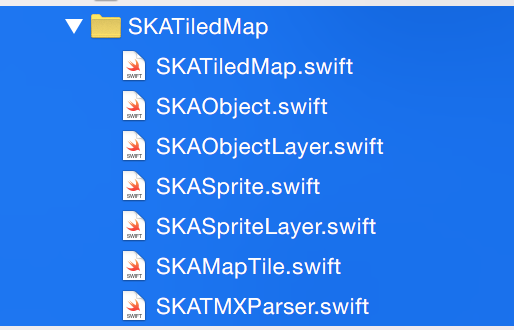
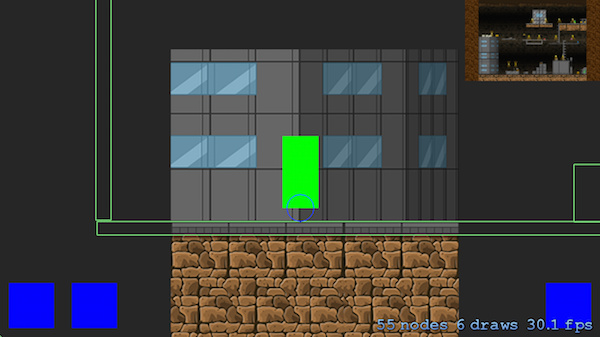
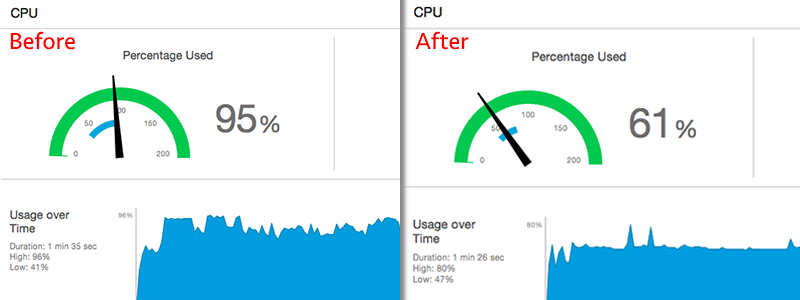

#SKATiledMap
SKATiledMap is a simple solution for creating a map using the free Tiled Map Editor and supportes .tmx and .json formats http://www.mapeditor.org/. 

The Sprite Kit Alliance is happy to provide the SKATiledMap free of charge without any warranty or guarantee (see license below for more info). If there is a feature missing or you would like added please email Skyler at skyler@skymistdevelopment.com.

##SKAToolKit Install Instructions
Copy all files in SKAToolKit folder into your project...yup that is it

##SKATiledMap
This is a sprite node that represents a map created in Tiled. Currently SKATiledMap only supports JSON format (tmx support coming soon). 

Add the JSON file and any images(see resolution support) used for your tiles into your project. To save your tiled map as JSON go to File->Export As in tiled and select .json

###Resolution Support

####Normal Tilesets
**It is important that you make your map in Tiled using 1x assets**. When you are ready to bring it into your app for best results provide 1x, @2x, and @3x assets. Keep in mind that there limitation with SpriteKit and texture sizes. Make sure your 1x assets do not exceed 675 x 675 (when at 3x they would be 2025 under the **2048 pixel limit**). Just like tiled you only need to import the images used to create your map. Put these images into an asset catalog for best results. No plist files or reference folders needed.

####Collection Tilesets
Tiled supports collection tilesets. **Make sure you design your map with 1x graphics.** You can provide 1x and 2x .atlas (or .atlasc if you have a .plist) folders containing the same image names you used to create your tile map. Remember to add .atlas and .atlasc folders to Xcode as reference folders (they should be blue). At the moment @3x is not supported in atlas folders (this was the case for iOS8 and lower but I have not tested this with iOS9).

###Supported Map Types

####TMX
TMX support is coming soon
    
####JSON
SKATileMap supports Tiled Maps that are exported in the JSON format. In Tiled export your map as a JSON file and import it into your app. To save as .json when in tiled go to File->Export As and select JSON. Make sure you locate all images you used for your map and import those along with any @2x and @3x version of those images (if using normal tilesets) or create atlas folders (if using collection tilesets). See Resolution Support for more info.

To create a map it is a simple matter of calling this method.

        let map = SKATiledMap(mapName: "SampleMapKenny") //name of your JSON file
    
###Useful Methods

    /**
     Culling "hiding" nodes that do not need to be rendered 
     greatly improves performace and frame rate.
     This method is optimized to be called every update loop
     @param x the center x index you wish to cull around
     @param y the center y index you wish to cull around
     @param width the number of tiles wide you would like to keep
     @param height the number of tiles high you would like to keep
    */
    func cullAround(x : Int, y : Int, width : Int, height : Int)
    
    /**
     Returns a CGPoint that can be used as an x and y index
     @param point the point in which to calculate the index
     */
    func index(point : CGPoint) -> CGPoint
    
    /**
     This method is used to get custom named objects that you may have 
     made in Tiled for spawning enemies, player start positions, or 
     any other custom game logic you made a object for.
     */
    func objectsOn(layerNumber: Int, name: String) -> [SKAObject]?
    
    /**
     Returns all the tiles around a specific index for a specific point. 
     Very useful if you need to know
     about tiles around a specific index.
     @param index the CGPoint that will be used as a x and y index
     @param layerNumber the layer in which you would like your tiles
     */
    func tilesAround(index : CGPoint, layerNumber : Int)-> [SKASprite?]
    
    /**
     Convientent method to quickly get a specific tile for a 
     specific layer on the map
     @param layerNumber the layer in which you would like to use
     @param x the x index to use
     @param y the y index to use
    */
    func spriteFor(layerNumber : Int, x : Int, y : Int) -> SKASprite
        
###Culling Feature
SKATiledMap now has a culling feature. Use this for big maps when you need better performance. The method is optimized to be called in the update loop and will set each sprite to hidden outside of the specified range.

	//for best resutls set a little wider/higher than your viewing area
    let playerIndex = map.index(player.position)
    map.cullAround(Int(playerIndex.x), y: Int(playerIndex.y), width: 5, height: 5)
    

    
    
###Using Layers
All layers are available. To do cool things with. For example you can take a layer and add a blinking effect for light sprites you may have.

    SKAction *fadeOut = [SKAction fadeAlphaTo:0 duration:.5];
    SKAction *fadeIn = [SKAction fadeAlphaTo:1 duration:.5];
    
    SKAction *repeat = [SKAction repeatActionForever:[SKAction sequence:@[fadeOut, fadeIn]]];
    
    SKASpriteLayer *layer =  self.map.spriteLayers[2];
    
    [layer runAction:repeat];

###SKATiledMap Auto Follow Feature
The SKATiledMap has an auto follow feature. This is a great feature if you want the map to position itself and keep a player on screen. To use this feature set the autoFollowNode to any subclass of SKNode and call the maps update method in the scene update method. 

    //showing ease of adding actions to a layer
    let fadeOut = SKAction.fadeAlphaTo(0, duration: 2)
    let fadeIn = SKAction.fadeAlphaTo(1, duration: 2)
        
    let sequence = SKAction.sequence([fadeOut, fadeIn])
    let repeatAction = SKAction.repeatActionForever(sequence)
        
    let backgroundLayer = map.spriteLayers[0]
    backgroundLayer .runAction(repeatAction)

###Auto Collision Generation
When creating your Tiled map SKATiledMap will create physical bodies if it finds these properties on a tile or object.

- SKACollisionType : SKACollisionTypeRect

###ZPosition and Optimization
SKATiledMap is optimized for `ignoresSiblingOrder`. Make sure you set your SKView to `skView.ignoresSiblingOrder = true` The zPosition is as follows. Layer one of tiles will be at zPosition 0 and layer two will be at zPosition 1. SKATiledMap also maximizes draw calls. You will only have as many draw calls as you have sprite maps.
    
###Contact Info
If you would like to get in contact with the SKA, email us at join@spritekitalliance.com
    
###License
Copyright (c) 2015 Sprite Kit Alliance

Permission is hereby granted, free of charge, to any person obtaining a copy of this software and associated documentation files (the "Software"), to deal in the Software without restriction, including without limitation the rights to use, copy, modify, merge, publish, distribute, sublicense, and/or sell copies of the Software, and to permit persons to whom the Software is furnished to do so, subject to the following conditions:

The above copyright notice and this permission notice shall be included in all copies or substantial portions of the Software.

THE SOFTWARE IS PROVIDED "AS IS", WITHOUT WARRANTY OF ANY KIND, EXPRESS OR IMPLIED, INCLUDING BUT NOT LIMITED TO THE WARRANTIES OF MERCHANTABILITY, FITNESS FOR A PARTICULAR PURPOSE AND NONINFRINGEMENT. IN NO EVENT SHALL THE AUTHORS OR COPYRIGHT HOLDERS BE LIABLE FOR ANY CLAIM, DAMAGES OR OTHER LIABILITY, WHETHER IN AN ACTION OF CONTRACT, TORT OR OTHERWISE, ARISING FROM, OUT OF OR IN CONNECTION WITH THE SOFTWARE OR THE USE OR OTHER DEALINGS IN THE SOFTWARE.

